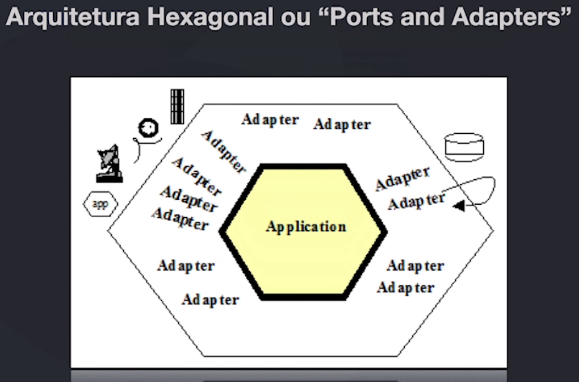
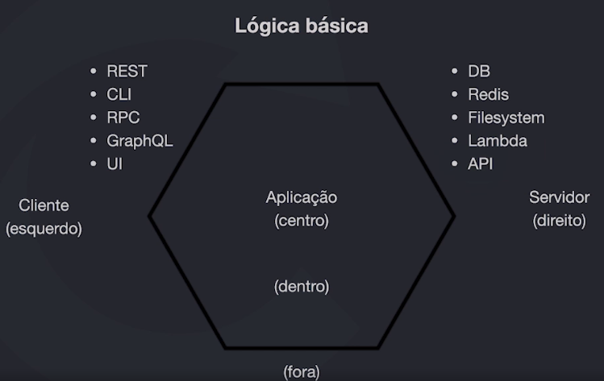

# Arquitetura Hexagonal

Também conhecido como "Ports and Adapters"

Primeiramente é importante identificar que existe uma diferença de complexidade em duas categorias.
Temos a complexidade de negócio e complexidade técnica.

A complexidade técnicas é a complexidade que VOCÊ escolhe utilizar enquanto a complexidade de negocio depende de quem precisa do problema resolvido, ou seja é extremamente importante separar/proteger o negocio. A complexidade técnica não deve invadir o negocio dessa forma é possível trocar de tecnologia.

## Pontos importantes de umas arquitetura

- Crescimento sustentável: Facilidade para atualizar o software.
- Software precisa se pagar ao passar do tempo.
- Software deve ser desenhado por você e não pelo seu framework.
- Peças precisam se encaixar e eventualmente ser substituídas

    "Arquitetura diz respeito com o futuro do seu software"

## Principais problemas de um ciclo convencional de software

- Visão de futuro
- Limites bem definidos
- Troca de adição de componentes (Adaptadores)
- Escala
    - Sessão, cash, upload, logs estão todos no mesmo servidor.
- Otimizações frequentes - 
- Preparado para mudanças

### Reflexões pós projeto

- Atualização dificil do software?
- Poderia ter sido evitado?
- Software está se pagando?
- Relação com o cliente está boa?
- Cliente terá prejuízo com a brusca mudança arquitetural?
- Em qual momento tudo se perdeu?
- Se você fosse novo na equipe, você julgaria os devs que fizeram tudo isso?

### Arquitetura vs Design

- Arquitetura é uma visão mais macro do sistema, na qual vai mostrar o que precisa existir para atender aos requisitos do cliente em termos de gerencia, escalabilidade, etc.
- Design especifica de forma mais micro as soluções, ou seja, seria o COMO será feito para implementar as decições tomadas na arquitetura.

## Resumo

Basicamente é uma estrutura em que o "coração" da aplicação se encontra separado dos elementos externos e TODOS
os elementos externos NÃO podem acessar diretamente as funcionalidades de regra de negocio, deve haver sempre
um adaptador para utilizar recursos externos.

- Faz a definição dos limites e proteção das regras da aplicação.
- Componentização e desacoplamento
    
    Serviços que normalmente podem ser desacoplados:
    - Logs
    - Cache
    - Upload
    - Banco de dados
    - Comandos
    - Filas
    - HTTP / APIs / GraphQL / Grpc
- Facilidade na quebra para microsserviços.

### Principio da inversão de dependência

- Módulos de alto nível não devem depender de módulos de baixo nível. Ambos devem depender de abstrações.

- Abstrações não devem depender de detalhes. Detalhes devem depender de abstrações.

## Link Uteis

