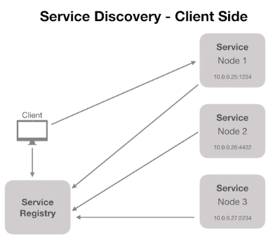

# Arquitetura de Software

## Pilares

- Organização de um sistema

- Componentização

- Relacionamento entre sistemas

- Governança

- Ambiente

- Projeto

- Projeção

- Cultura

## Frameworks

TOGAF - Framework conceitual

- Ajuda a definir os processos de arquitetura. 
- Possui mais de 900 paginas. (Formal demais e verboso demais).
- Seta conceitos e nomeclaturas.
- Visão geral de tipos de arquiteturas:
    - Negócios
    - Sistemas de informação
    - Tecnologia
    - Planos de migração

ISO/IEC/IEEE 42010:2011 - Systems and software engineering - architecture description

- Lançada em 2011 pela ISO.
- Simplificado em relação ao TOGAF.
- Formaliza os fundamentos de área de arquitetura de software.

## Sistemas Monolíticos

- Tudo dentro do mesmo sistema
- Alto acoplamento
- Processo de Deploy "completo" a cada mudança.
- Normalmente usa uma tecnologia
- Um problema afeta todo o sistema
- Maior complexidade para times

- Não é crime usar sistema monolítico
- Na maioria dos casos vai atender
- Menos complexidade na maioria dos casos

## Escalando Software

- Escala vertical: Aumentar o recurso computacional.
- Escala Horizontal: Aumentar o número de máquinas para compor. Utiliza um load-balancer para gerenciar para quem vai os recursos.

### Detalhes sobre arquitetura de aplicação

- Discos efêmeros: informações temporarias.
- Servidores de aplicação vs Servidores de assets.
- Cache centralizado
- Sessões centralizadas (Esse problema tem na VERT)
- Upload / Gravação de arquivos: A maquina não pode conter essas coisas, deve ficar separado.

    TUDO PODE TER QUE SER DESTRUIDO E CRIADO FACILMENTE.

## Distribuição de responsabilidades

- Static: Local onde ficam os armazenamento de arquivo, imagens, etc.
- Elastic: Monitoramento externo a aplicação
- Cache: Deve ficar separado ao cluster de aplicação
- DB: Deve ficar externo a aplicação
- Proxy Reverso: Responsável por receber todo o trafego web e distribuir as requisições.
- App: Aplicação pura e isolada dos demais componentes.

### Escala horizontal: Aplicação monolítica

- Ter imagens / containers: Ex: aumentar o numero de PODs
- Ser facilmente reconstruido
- Ter suas responsabilidades, incluindo assets, etc.
- Sim, aplicações monoliticas podem ser totalmente escaláveis.

### Quando a aplicação monolítica pode parar de valer a pena?

- Times grandes
- Necessidade de escalar todo o sistema pelo fato de uma área em específico estar com pico de utilização.
- Risco de um deploy completo começa a se elevar
- Necessidades de utilizar tecnologias diferentes

## Microserviços

### Serviço

- Disponibiliza informação
- Realiza transações
- Resolve problemas de negócio
- Independe de tecnologia ou produto
- Pode estabelecer comunicação com diversos "clientes"

### SOA: Arquitetura orientada a serviço

- Enterprise Service Bus (ESB): pega diversos sistemas ou serviços e tudo é conectado nele, com isso ele disponibiliza o serviço para quem quiser utilizar.

- Serviços normalmente maiores baseados em funcionalidades
- Necessidade de ESB
- Single point of failure
- Compartilhamento de bancos de dados é comum

### SOA: Arquitetura orientada a serviço

- Banco de dados individual
- Serviços que possuem poucas responsabilidades
- Maior tolerância a falhas
- Totalmente independente (Proprio banco, propria infra, propria autenticação (token por exemplo))
- Cada serviço possui seu próprio banco de dados
- Comunicação síncrona ou assíncrona

### Microserviços não são para todas as situações.

- Arquitetura complexa
- Custo mais elevado
- Necessidade de mais equipes para manter
- Sistema precisa ser grande o suficiente para justificar
- Gera problemas que normalmente você não tinha antes
- Monitoramento complexo

    Microserviços não são moda, mas sim necessidade.

## Principais caracterisicas de Microserviços.

### Componentização via serviços
- Componente é uma unidade de software independente que pode ser substituida ou atualizada.

#### Desvantagens

- Chamadas externas são mais custosas do que chamadas locais.
- Cruzamento entre componentes pode se tornar complexo.
- Transações entre serviços são "grandes desafios".
- Mudanças bruscas e regras de negócio podem afetar diversos serviços tornando o processo difícil de ser refeito.

#### Conceitos importantes

- Um projeto é baseado em um ou mais produtos que trabalham em diferentes contextos. Ou seja, para implementar algo em microserviço ele precisa agregar algo efetivamente para o produto final e não fazer por que sim.

#### Organização em torno do negócio

- Time de desenvolvedores por produto. assim é possível ter o fluxo completo por produto dentro de uma mesma equipe.
- Muitas empresas tratam os times como "squads".
- Cada squad é multidisciplinar
- Cada squad é responsável por um ou mais produtos
- Cada produto pode ter um ou mais serviços envolvidos

#### Smart endpoints & dumb pipes

- Exposição de APIs (ex:REST)
- Comunicação entre serviços
- Comunicação síncrona e assíncrona
- Utilização de sistemas de mensageria (ex: RabbitMQ)
- Garantia de que um serviço foi executado baseado na execução das filas

#### Governança descentralizada

- Cada serviço tem suas proprias regras.
- SLA, grau de disponibilidade, documentação, etc.
- Ferramenta certa para o trabalho certo. Tecnologias podem ser definidas baseadas na necessidade de produto.
- Diferentes padrões entre squads
- Contratos de interface de forma independente

#### Automação de infraestrutura

- Cloud computing
- Testes automatizados
- Continuous delivery e Continous deployment
- Continuous Integration
- Load balancer /Autoscaling

#### Desenhado para falhar

- Desenhar planos para minimizar os danos de quando cada microserviço sai do ar.
- Tolerância a falha.
- Serviços precisam de fallback
- logging DE TUDO
- Monitoramento em tempo real
- Alarmes

#### Design Evolutivo

- Produtos bem definidos podem evoluir ou serem extintos por razões de negócios.
- Gerenciamento de versões. Publicar versões diferentes de um serviço para que pessoas com versões antigas não fiquem indisponíveis e dar um tempo para que os clientes se adequem a nova versão para enfim você descontinuar uma versão.
- Replacemente and upgradeability

## API Gateway

Serviço responsável por receber todas as chamadas de APIs dos clientes e então as roteia para os microserviços correspondentes... (nginx.com)

Em alguns casos ela também é responsável por realizar processos de verificação de segurança, como autenticação e autorização.

## Serviço Discovery

Processo de service discovery é responsável por prover mecanismos de identificação dos serviços disponíveis e suas instâncias.

### Client e Server Side

- Service Registry: Serviço onde estão registrados os nodes que estão UP.

Cliente busca no registry a informação para saber qual node deve ser consultado e então faz o acesso, é possível fazer helth check durante esse processo também.

E de função do serviço que está sendo provido enviar os dados corretos para o service registry para que seja consultado os valores corretamente pelo cliente. É normal possui um load balancer na frente de tudo isso fazendo a consulta no registry.

### Ferramentas populares.

- Netflix Eureka - Facil pra implementar com Java
- Consul - (Wesley usa kkk, possui service discovery, key value, DNS e tem health check, feito em Go)
- Etcd
- Zookeeper

    kubernets tem uma implementação para isso propria. Procurar saber

## Comunicação entre microserviços

Pode ser sincrona ou assincrona

Processamentos pesados travam o processo por muito tempo na forma sincrona.

Para comunicação assincrona uma solução possível seria utilizar um serviço de mensageria para interceptar e gerenciar o envio e recebimento dessas mensagens.

### RabbitMQ

- Message Broker
- Implementa o AMQP (Advanced Message Queuing Protocol)
- Producers <=> Brokers <=> Consumers
- Desacoplamento entre serviços
- Rápido e Poderoso
- Padrão de mercado

- binding key: Campo que define para onde a mensagem será enviada. A mensagem acopla uma 'routing key' que deve bater de acordo com a binding key:
- Exchange: Parte interna ao rabbit responsável por definir para qual fila vai ser enviado uma determinada informação.

### Tipos de mengagens

- Fanout: Modo de mensagem que você deseja que seja enviado para TODAS as filas.

- Direct: possui routing key e ao chegar no broker irá procurar por uma binding key a uma fila.

- Topic: Parcial match, ex: chamada.*, batata.* e ele ira procurar por patterns.

## Dupla latência

Implica no tempo de resposta para o cliente final e que com um sistema monolítico você acaba tendo menos impacto com muitas requisições, mas quando isso se aplica em micro serviços é comum ter VARIAS etapas de comunicação para um pedido "simples" do cliente.

Serviços monoliticos possuem poucas etapas de comunicação logo não 

## BFF - Backend for Frondend

É uma camada de formatação para cada dispositivo, filtrando as informações enviadas para cada dispositivo, exemplo, as informações que a aplicação desktop precisa são diferentes do que um computador utilizando a aplicação.

