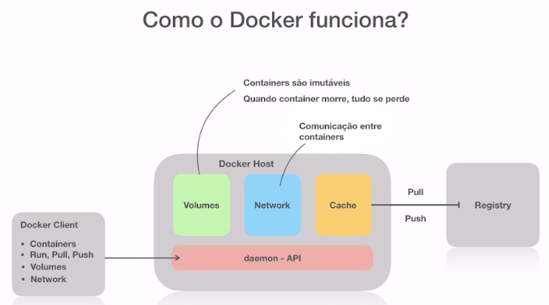

# Resumo do modulo de DOCKER

## Conceitos Basicos de funcionamento


## O que são containers

*Container* é um padrão de unidade de software que empacota código e todas as dependências de uma aplicação.
Utiliza de namespace para cobrir, pids, users, network e file system. O container principal fica mascarado para o sistema operacional na forma de um processo, e todos os processos instanciados por ele ficam contidos no namespace desse processo, ficando isolado, ou seja se o processo principal for morto o container INTEIRO é morto.

*Cgroups* - Isola os recursos computacioanis para não impactar nos demais recursos utilizados, com isso é possível limitar a memoria e o número de cpus utilizadas 

*OFS* - Utiliza sistema de camadas de alterações além de aproveitar os recursos do sistema operacional nativo que está sendo utilizado, ou seja, as dependências de kernel por exemplo não precisar ir para dentro do container.

*Imagens* - Objeto gerado a partir de um build. A imagem possui um estádo imutável e a partir do momento que ela está rodando é criado uma camada de leitura e escrita em cima para que se possa gerenciar arquivos, mas não é possível alterar a imagem em si.

É possível gerar a imagem de duas formas:

1) Fazendo o build via Dockerfile/Docker-compose ou baixando umas imagem de algum repositório
2) Utilizar um container RODANDO, e após as alterações utilizar um commit e gerar uma nova imagem.

*Image Registry* - É um local onde são armazenados e consultadas as imagens que foram geradas, pode ser um repositório privado ou publico.

*Docker Client* - Possui os recursos para operar sobre o container e gerar a imagem.

*Docker Host* - Possui: 
Volumes - para mapear diretórios permitindo persistência dos dados. <br>
Network - Mapeamento de rede interno para portar externas, além de conexão entre os containers.<br>
Cache - Armazena imagens em camadas para não precisar baixar com frequência.

Tudo que é gravado no docker é perdido quando ele é reiniciado a menos que seja mapeado em disco as alterações.
----------

### Resumo



    Namespace - isola os processos.
    Cgroups - Controla os recursos computacioanis.
    File System - OFS (Overlay File System) - Camadas de atualizações.
    Dockerfile - Arquivo para personalizar uma imagem a partir de uma imagem base.
    Image Registry - Repositório de imagens


## Dockerfile

    FROM: ImageName - imagem base para construir a imagem personalizada

    RUN: Comandos ex: apt-get install batata - Comandos que serão executados em cima da imagem base

    EXPOSE: 8000 - expoe uma porta para que ela se torne acessível.


## Comandos

    docker ps - Mostra quais os containers que estão ativos.
    docker ps -a - Todos os containers ativos e os mortos
    docker run <image_name> - Tenta executar uma imagem, se não conseguir ele irá procurar no registry e baixar.
    docker run -it ubuntu bash - Executa o ubuntu com a shell na forma interativa.

    docker attach <container_name> - entra no comando desatachado dentro do container.

    -p <porta_host>:<posta_container> faz o mapeamento de porta externa para porta interna do container.

    -d - deatached, ou seja, executa o container e não prende o container.

    docker stop $(docker ps -a -q) - Mata os container TUDO MEU PARCEIRO


- Comandos simples

    docker stop <container_id> - para o container especificado.
    docker start <container_id> - inicia o container parado.

    docker rm <container_id> - remove o container.
    docker rm -f <container_name> - remove o container, de forma forçada.

    docker run --name batata nginx - gera um container com o nome especificado.

    docker exec - executa um comando no nosso container.
    ex1: docker exec batata ls
    ex2: docker exec -it batata bash - prende o terminal no container e executa o bash

    docker run -d --name nginx -p 8080:80  -v ~/path_absoluto
    -v - comando antif

    docker rmi <img_name> - remove a imagem especificada.

- Mapeando volumes

    docker run -d -v $"(pwd)"/html/x:/usr/share/nginx/html nginx - Executa o container e mapeia uma pasta local do servidor de origem para o container de destino,se a pasta x existir, ela será criada.
    
    ... --mount type=bind,source="$(pwd)"/dir,target=/usr/share/nginx/html nginx - Cria o container e mapeia a pasta dir de onde vc estiver para a pasta interna que você especificar.


### Volumes

No docker volumes são um conjunto de comandos que podem ser utilizados para criar estruturas separadas, por exemplo.

    docker volumes - mostra os comandos que podem ser utilizados com volumes

    docker voluems ls - lista seus drivers e os nomes

É possível mapear esse volume para diversos containers ao mesmo tempo.

    docker volume create meu_volume - cria volume chamado meu_volume

    docker volume inspect meuvolume - Mostra as propriedades do container.

Agora é possível mapear esse volume pra dentro de uma pasta dentro do container.

    docker run --name nginx -d --mount type=volume,source=meu_volume,target=/app nginx

    docker run --name nginx2 -d --mount type=volume,source=meu_volume,target=/app nginx

    docker run --name nginx3 -d -v meuvolume:/app nginx

    exec "$@" - Colocar no final do arquivo de entry_point.sh para permitir executar outros comandos através do comando CMD.

Pronto agora você tem um volume mapeado em três containers ao mesmo tempo.

Para limpar os volumes existem outros comandos necessários.

    docker volume prune - remove todos os volumes
    docker volume delete <nome> - remove um volume específico.

Cria uma servidor web com um ponto de montagem usando apache2

     docker run -d -it --name web_dev -p 9000:80 --mount type=bind,source="$(pwd)"/web,target=/usr/local/apache2/htdocs httpd:latest

## Imagens


## Imagens Diferentes:

### nginx

    docker run -d -p 8080:80 nginx

Executa o web server em background e mapeia a porta 8080 da maquina hospedeira para a porta 80 do container.

/usr/share/nginx/html - Local armazenado da pagina web.

## Dockerfile

Arquivo que especifica tudo que será feito ao subir e rodar uma imagem.

Cada comando gera uma camada diferente.

    docker build -t usuario_dockerhub/image_name:tag .

'.' - local referente ao local onde está o dockerfile

workdir - cria um diretório dentro do container para trabalhar

copy - copia um diretório da maquina local para dentro do container.

    COPY file_ou_dir path/dentro/container

É possível fixar o usuário que vai ser iniciado dentro do container.

    USER root

O Docker possui CMD e ENTRYPOINT, o ENTRYPOINT basicamente é um comando fixo que não pode ser sobrescrito e que será executado dentro do container, enquanto o CMD possui duas funcionalidades. Primeira quando não existe ENTRYPOINT ele é usado como comando mas pode ser substituido na execução do container. Segundo, quando existe o ENTRYPOINT ele é utilizado como parâmetro para o comando especificado no ENTRYPOINT, mas o parâmetro ainda pode ser substituido vira docker run.

## Exportar para o registry

É necessário logar no registry

    docker login

É necessário ter no nome da imagem o nome do seu usuario/nome_da_imagem

    docker push coudbenks/img_braba

## Network

- Bridge - Padrão
- Host - Permite acesso direto ao host, ou seja os dois ficam na mesma rede. Evita mapeamento de porta.
- Overlay - Usado para fazer o docker swam (Ver primeiro video de rede)
- maclan - Não entendi mt bem
- none - Container não faz parte de nenhuma rede.

Docker swarm cria um cluster de varios docker utilizado para escalar os processos.

    ip addr show - lista os IPs das redes nos linux ubuntu like.

Para fazer o docker acessar a maquina local é possível utilizar um dns interno

    host.docker.internal - Retornar o IP da maquina principal do qual o docker possui interface para se comunicar.

### Bridge

Exemplo 1

    docker network - lista os comandos possíveis.
    docker network ls - lista as redes.
    docker network inspect bridge - Mostras as configurações das redes que estão em bridge.

docker run -dit --name ubuntu1 bash

docker run -dit --name ubuntu2 bash

Quando roda os containers no padrão é importante ressaltar que não é efetuado resolução de nome.

Exemplo 2

    docker network create --driver bridge minharede

    docker run -dit ubuntu1 --network minharede bash
    docker run -dit ubuntu2 --network minharede bash
    docker run -dit ubuntu3 bash


    docker exec -it ubuntu1 bash
    ping ubuntu2

Agora é possível verificar que a resolução de nome ocorre.

É possível conectar um container em uma network.

    docker network connect minha rede ubuntu3

## Criando sua própria imagem

Uma das melhores formas de ter a imagem personalizada exatamente para o seu caso é literalmente seguir o processo de instalação passo a passo baseado em uma imagem que tenha interesse e especificar exatamente cada operação direto no Dockerfile

### Exemplo 1

    docker pull php:7.4-cli

ao entrar no container execute todos os comandos para a instalação completa da linguagem/framework + dependências necessárias e anote todos os passos passando cada etapa para um Dockerfile para que ao subir um container ele consiga cumprir os passos corretamente.

```Dockerfile
    FROM php:7.4-cli

    RUN apt-get update && \
        apt-get install vim

    WORKDIR batata/

    ENTRYPOINT ["bash"]
```

O exemplo acima é meramente ilustrativo.

## Desenvolvendo dentro de containers

O exemplo abaixo é o deploy para desenvolver em node utilizando direto o docker.

    docker run --rm -it -v $(pwd)/:/usr/src/app -p 3000:3000 node:15 bash

Com o comando acima estamos mapeando a pasta local do seu projeto para dentro do diretório /usr/src/app do container, ou seja tudo que for criado na sua pasta local vai para esse local dentro do container e visse versa, ou seja, ambos são referênciados como o mesmo volume. Com isso é possível executar os comandos do node dentro do container e programar fora do container, com isso é possível obter o melhor dos dois mundos.

### Gerando a imagem

É de interesse do usuário após programar gerar uma imagem da aplicação.

Criar um Dockerfile dentro do projeto e preencher ele com as especificações do projeto.

```Dockerfile 
    FROM node:15

    WORKDIR /usr/src/app

    COPY . .

    EXPOSE 3000

    CMD ["node","index.js"]
```

Talvez seja relevante utilizar mais um dockerfile, sendo um para dev e outra para produção.

## Otimização de imagens

É possível fazer o que é chamado de multistage building, ou seja a partir de uma build é feito outro build em cima.

```Dockerfile 
    FROM php:7.4-cli as builder

    WORKDIR /var/www

    RUN apt-get update && \
        apt-get install libzip-dev -y && \
        docker-php-ext-install zip

    RUN php -r "copy('https://getcomposer.org/installer', 'composer-setup.php');" && \
        php composer-setup.php && \
        php -r "unlink('composer-setup.php');"

    RUN php composer.phar create-project --prefer-dist laravel/laravel laravel

    FROM php:7.4-fpm-alpine
    WORKDIR /var/www
    RUN rm -rf /var/www/html
    COPY --from=builder /var/www/laravel .
    RUN chown -R www-data:www-data /var/www
    EXPOSE 9000
    CMD [ "php-fpm" ]
```

Para cada comando FROM que você utiliza, é iniciado um novo build, ou seja, é importante copiar a parte relevante do build anterior e remover tudo que foi instalado e permaneceu mas desncessariamente.

```Dockerfile 
    COPY --from=stage
```

É possível especificar um local do stage build anterior para copiar arquivos e trazer para o novo build, dessa forma o que foi usado para gerar a imagem é deixado para traz e utilizado apenas os excencial para sua aplicação.

## Proxy Reverso com Nginx

Objetivo: Utilizar o nginx como proxy reverso, ou seja a requisição vai vir para o proxy encaminhar para o serviço e retornar para o proxy que vai retornar para o cliente.

- Consultar o video ngix como proxy reverso

## Dockercompode

É uma ferramenta baseado em um arquivo de manifesto (arquivo yaml) é possível configurar e subir um container com um unico comando.


```yaml
version: '3'

services:
    laravel:
        build:
            context: ./laravel
            dockerfile: Dockerfile.prod
        image: coudbenks/laravel:prod
        container_name: laravel
        networks:
            - laranet
    nginx:
        build:
            context: ./nginx
            dockerfile: Dockerfile.prod
        image: coudbenks/nginx:prod
        container_name: nginx
        networks:
            - laranet
        ports:
            - "8080:80"

    networks:
        laranet
            driver: bridge
```

docker-compose up - sobe os containers
docker-compose down - remover os containers.

docker-compose ps - mostra os containers especificados pelo docker-compose


### Configuração de banco de dados

```yaml
version: '3'

services:
    db:
        image: mysql:5.7
        command: --innodb-use-native-aio=0
        container_name: db
        restart: always
        tty: true
        volumes:
            - ./mysql:/var/lib/mysql

        enviroment:
            - MYSQL_DATABASE=nodedb
            - MYSQL_ROOT_PASSWORD=root
            - MYSQL_USER=root
        networks:
            - node-network

    networks:
        node-network
            driver: bridge
```
## Docker dependence

Container podem ter algumas dependências como esperar o banco de dados subir para iniciar uma aplicação. Nesse caso existem alguma ferramentas uteis para fazer isso como o [dockerize](https://github.com/jwilder/dockerize)

Basicamente ele fica tentando se comunicar com o container até conseguir, quando conseguir ele finaliza o script e você pode seguir com o deploy daquela aplicação.


