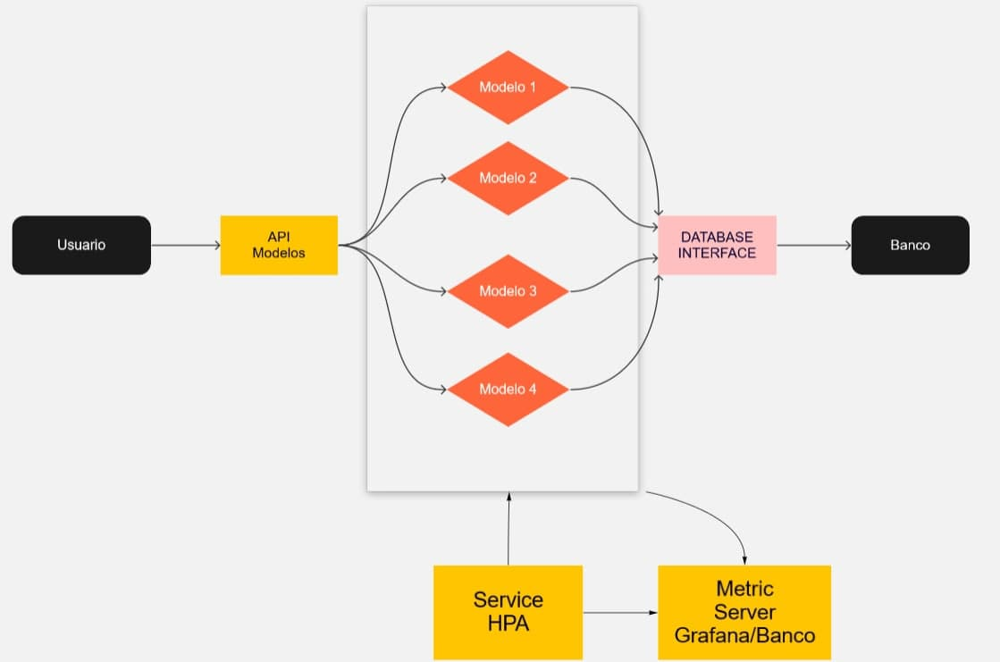

Basicamente eu quero ter um conjunto de consumidores que recebam uma determinada imagem por requisição, utilize um modelo preditivo em cima dessa imagem e retorno pro cliente.

### Problema 1

- É possível subir um sistema em que esse modelo é compartilhado com restrição de somente leiturar para economizar memoria ram?

### Problema 2

- Uma comunicação assincrona é feita para uma fila de mensageria que em torno de 30 segundos produzirá um resultado. Que tipo de arquitetura vocês recomendariam? Existe alguma ferramenta que facilite isso?

Um ponto que eu gostaria que fosse importante é depender o mínimo possível de quem faz o request dado que eu n tenho controle sobre a aplicação que vai consumir essa API.

### Dúvida

Vocês conhecem/recomendam alguma ferramenta para calcular quantidade de recursos fisicos?
Atualmente eu utilizo o consumo dos recursos via grafana e simulo a entrada de dados que eu quero.

Ou dado um conjunto de projetos rodando, no pior caso precisariamos de X gigas de ram mas na media utilizariamos apenas 50% disso.

