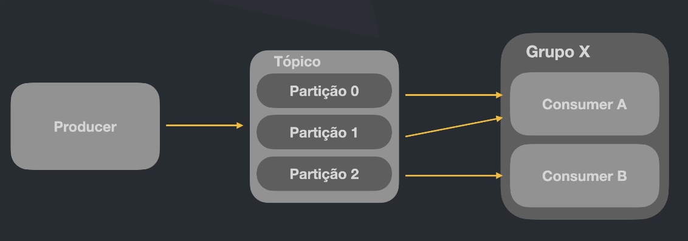

# Kafka

Basicamente é uma plataforma de streaming de eventos open-source.

[kafka-home-page](https://kafka.apache.org)

Vantagens:
- Altíssimo throughput
- Latência extremamente baixa (2ms)
- Escalável
- Armazenamento (Area de banco de dados para guardar as informações/eventos)
- Alta disponibilidade
- Se conecta com quase tudo
- Bibliotecas prontas para as mais diversas tecnologias
- Ferramentas open-source

Desvantagens:
- Possui um grau de complexidade mínimo envolvido na implantação
- Necessita de um ambiente em cluster, recomendado pagar alguem pra gerenciar ou arcar com o custo.
- Recomendação minima para manter em produção, 3 brokers

Obs:
Zookeeper era um serviço que funcoinada em conjunto com o kafka, hoje em dia estão separando os sistemas, mas é importante saber que sistemas legados podem estar funcionando com ele.

Producer --> Kafka --> Broker <-- Consumidor

## Topic

Canal de comunicação responsável por receber e disponibilizar os dados enviados para o kafka

Um topic pode ser lido por multiplos consumidores, a informação após ser lida ela NÃO é consumida.

### Partições
Cada topico pode ter uma ou mais partições. A partição tem como proposito agrupar as mensagens de forma que os consumidores não tenham colisão com o processamento. Além disso também é possível obter através de redundancia de informação manter a disponibilidade dos dados usando 3 ou mais hosts.

- Como manter a ordem das mensagens?

### Liderança

Cada Partição ficando salva em mais de um local necessita de uma prioridade de quem deverá ser lido. Nesse caso exister os Leader e o Follower onde os lideres SEMPRE serão lidos primeiro, o unico momento onde isso é alterado é quando um dos nós morrer e será detectado pelo sistema que a partição lider está fora do ar e ocorrerá uma nova eleição para a partição.

## Produtor

### Tipos de Garantira de entrega

- Ack 0 - Não exige retorno de resposta entre Produtor e broker, apenas um modelo de FF(Fire and Forget).
    Útil em situações onde a perda de informação não é crucial, como por exemplo geolocalização em tempo real. Ela não é impactada completamente se for perdido umas das informações.

- Ack 1 - Uma mensagem é enviada do produtor para o broker, o broker vai salvar e enviar uma resposta de que a mensagem foi salva.
    Problemas: Caso o broker caia logo após enviar a mensagem é POSSÍVEL que a mensagem salva não tenha sido replicada gerando perda de dados.

- Ack -1(ALL) - Producer enviar a mensagem pro Leader, Leader primeiro REPLICA a mensagem em TODOS os followers e aguarda a confirmação de todos eles de que a mensagem foi salva, somente ai é enviado a resposta para o producer de que a mensagem foi efetivamente salva.
    Problemas: Processo mais custoso de comunicação e armazenamento.

- at most once: Pode perde uma mensagem - mas é rapidão
- at least once: Pode duplicar mensagem mas tem uma performance interessante ainda(Cuidado no consumidor para saber se aquela mensagem ja foi processada)
- Exacly once: Exatamente uma unica vez, mas possui a performance mais lenta.

### Indepotência

É um modo que permite o kafka identificar o caso em que o PRODUTOR envia a mensagem duplicado, isso pode acontecer por exemplo por erros de conexão somados a politicas de retry internas. Provoca um pouco de lentidão mas evita esse tipo de caso.

## Consumidor

O kafka trabalha com "consumer groups" em que ele distribui as partições de acordo com o numero de consumidores em cada grupos, ou seja, Se existem 3 partições e 1 grupo com 2 consumidores ele vai conseguir distribuir as partições entre os consumidores.

Obs: Caso o consumidor não esteja em um grupo ele por si só será considerado um grupo com um unico integrante, ou seja, ela irá ler de todas as partições, caso isso não seja desejado é importante associar ele a um grupo.

No kafka cada partição deve ser lida por um único consumidor dentro de um mesmo grupo, com isso é importante verificar que não adianta o numero de consumidores ser maior que as partições pois eles vicarão "idle" e caso o numero de partições seja maior que o numero de consumidores alguem irá ficar sobrecarregado.

Obs: Grupos diferentes podem ler da mesma partição, lembrar disso para evitar comportamento insejado caso esqueça de declarar os grupos de consumidores.

## Kafka Commands

O arquivo docker compose associado a esse diretório sobe os serviços do zookeeper, o kafka e um controler para facilitar o gerenciamento da aplicação.

Aqui serão apresentados alguns comandos uteis para gerenciamento das configurações via linha de comando que para fins didaticos é importante para compreender a funcionalidade sem se prender a interface grafica de softwares de terceiros.

- kafka-topics
- kafka-console-consumer
- kafka-console-producer

### Gerenciando Topicos

Primeiramente para teste será criado um tópico com nome teste.

    kafka-topics --create --topic=teste --bootstrap-server=localhost:9092 --partitions=3

o bootstrap-server é o servidor onde está hospedado o kafka que no caso é o container do kafka.

Para verificar que foi criado devidamente é possível utilizar o comando a baixo.

    kafka-topics --list --bootstrap-server=localhost:9092

Com isso será possível ver todos os tópicos criados. Apenas para lembrar, ao subir o controler ele automaticamente criar DIVERSOS tópicos, mas no momento pode apenas ignorar eles. Procure pelo topico chamado de **teste**, caso esteja ai, o tópico foi criado com sucesso.

Agora vamos verificar como ficou a configuração do topico.

    kafka-topics --bootstrap-server=localhost:9092 --topic=teste --describe

Você vera que o replicationFactor está em 1, dado que temos apenas uma maquina com o kafka no nosso "cluster", não faz sentido aumentar esse valor mas ele deve ser **setado ao criar o topico**.

### Testando o topico

É possível testar o tópico utilizando, para isso serão necessárias duas shells. Uma para o consumidor e outra para produzir mensagens. Lembrando que isso normalmente é feito através do software, essas etapas de produzir e consumir não são feitas normalmente via linha de comando.

#### Producer

    kafka-console-consumer --topic=teste --bootstrap-server=localhost:9092 --from-beginning --group=x

    kafka-console-producer --topic=teste --bootstrap-server=localhost:9092

O primeiro comando inicializar o consumidor em um grupo com nome 'X' no topico teste.

### Anatomia de um registro

Offset:
    Headers
    keys
    Value (payload)
    Timestemp
