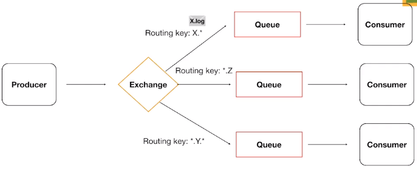

# RabbitMQ

## Caracteristicas

- Message Broker
- Implementa o AMQP (Advanced Message Queuing Protocol)
- Implementa outras protocolos também (MQTT,STOMP e HTTP)
- Desenvolvido em Erlang
- Producers <=> Brokers <=> Consumers
- Desacoplamento entre serviços
- Rápido e Poderoso (Por padrão guarda tudo em memória)
- Padrão de mercado

- binding key: Campo que define para onde a mensagem será enviada. A mensagem acopla uma 'routing key' que deve bater de acordo com a binding key:
- Exchange: Parte interna ao rabbit responsável por definir para qual fila vai ser enviado uma determinada informação.

### Por baixo dos panos...

Abre uma unica conexão persistente e para cada novo channel é uma nova thread no servidor. 

### Tipos de Exchange/mengagens

- Fanout: Modo de mensagem que você deseja que seja enviado para TODAS as filas.

- Direct: possui routing key e ao chegar no broker irá procurar por uma binding key a uma fila.

- Topic: Parcial match, ex: chamada.*, batata.* e ele ira procurar por patterns.

- Headers: No header da mensagem fica especificado para qual fila deve ser enviada as mensagens.

#### Direct

- Bind: Processo de relacionar uma fila a uma exchange

#### Topic

## Queue

- FIFO
- Propriedades:
    - Durable: Se ela deve ser salva mesmo depois do restart do broker 
    - Auto-delete: Remove a fila automaticamente quando o consumer se desconecta.
    - Expiry: Define o tempo que não há mensagens ou clientes consumindo (Não tem consumidor ou produtor por algumas hroas, então ele mata a fila)
    - Message TTL: Tempo de vida da mensagem. Se ninguem consumir a mensagem da fila em X tempo, ela é removida da fila.
    - Overflow: Quando a fila transborda
        - Drop head (remove a última/mais antigo):
        - Reject Publish: O publicador não consegue publicar mais nessa fila.
    - Exclusive: Somente channel que criou pode acessar.
    - Max Length ou bytes: Quantidade de mensagens o tamanho em bytes máximo permitido.
        - Caso aconteça, teremso um overflow e podemos escolher em remover as mensagens mais antigas ou rejeitar a nova.

### Dead Letter Queues

- Algumas mensagens não conseguem ser entregues por qualquer motivo.
- São encaminhadas para uma exchange específica que roteia as mensagens para uma dead letter queue
- Tais mensagens podem ser consumidas e averiguadas posteiormente.

### Lazy queues

- Mensagens são armazenadas em disco
- Exige alto I/O (Muito mais custoso)
- Quando há milhoes de mensagens em uma fila, por qualquer motivo, há a possibilidade de liberar a memória, jogando especificamente as mensagens da fila em questão em disco.

### Rabbitmq Simulator

[Simulador de rabbitmq](http://tryrabbitmq.com)

Aplicação web para testar e brincar com o rabbitmq e entender melhor seu funcionamento de forma simples e didatica.

### Confiabilidade

- Como garantir que as mensagens não serão perdidas no meio do caminho?
- Como garantir que as mensagens puderam ser processadas corretamente pelos consumidores?
- Recursos do RabbitMQ pensados para resolver tais situações.
    - Consumer acknowledgement: Quando o consumidor avisa que recebeu
    - Publisher confirm: Todas as vezes que enviar uma mensagem você quer ter certeza que ta tudo 100%
    - Filas e mensagens duráveis / persistentes

#### Consumer acknowledgement

- Basic.Ack: Consumidor enviar um aviso de que recebeu e conseguiu processar.
- Basic.Reject: Faz a mensagem voltar e ficar na fila. Ou seja não conseguir processar ela.
- Basic.Nack: Consegue rejeitar mais de uma mensagem de uma vez só.

#### Publisher confirm

- Utiliza um id para gerenciar as mensagens e passar a poder enviar um ACK para uma mensagem específica. É de responsabilidade do DESENVOLVEDOR implementar esses identificador, o mesmo deve possuir valor inteiro.

O aviso quem recebe nesse caso é o Publisher, ou seja, são duas abordagens diferentes. Uma parte do consumidor e a outra parte do produtor.

- Vhost ou Virtual Host Serve para isolar contexto entre as filas. É possível ter um vhost='/' com uma fila X e um vhost='/videos' com uma fila X também. pois são contextos diferentes.

Por padrão ele possui algumas exchanges por padrão para cada tipo.